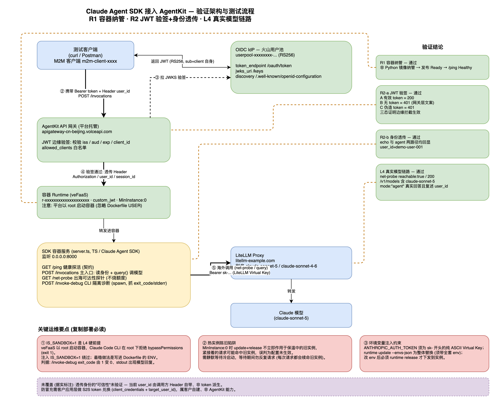
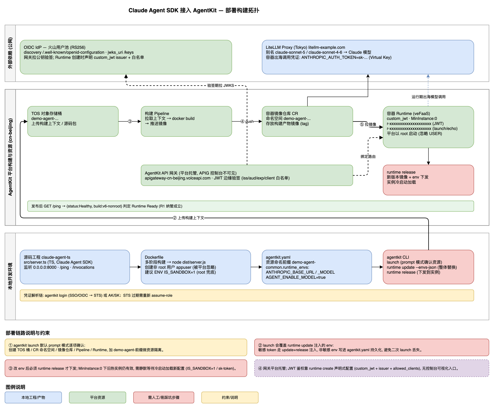
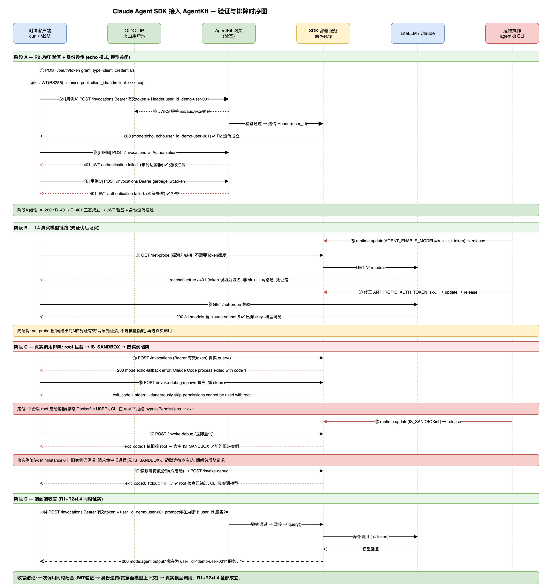
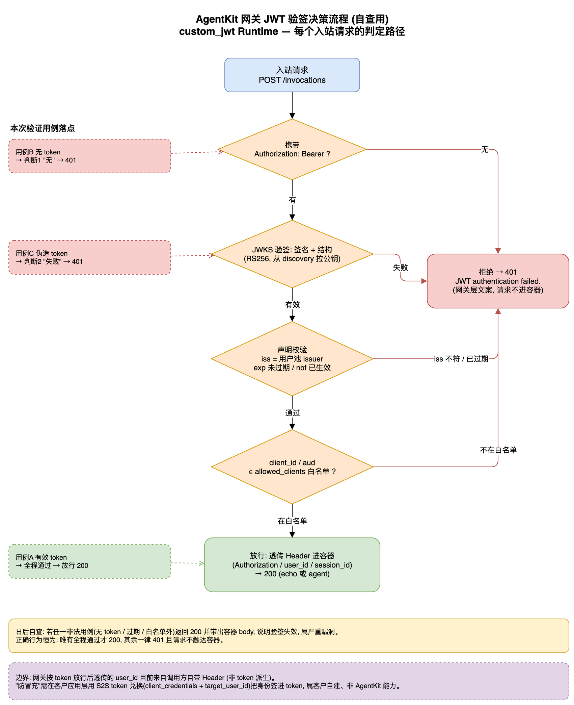

# Claude Agent SDK 接入 AgentKit — 能力验证

本仓库记录并复现「基于 Claude Agent SDK 开发的 Agent 容器，能否直接由火山引擎 AgentKit 平台纳管并复用平台鉴权」的验证过程与结论。

- 项目背景：示例 Agent Platform
- 验证对象：AgentKit Runtime 对通用容器的纳管能力、网关 JWT 边缘验签与用户身份透传能力
- 结论：核心需求 R1、R2 全部通过；附加项 L4（真实模型链路）端到端打通

> 说明：本仓库为公开分享版本，所有账号 ID、Runtime ID、网关 Endpoint、镜像仓库、Pipeline ID、API Key、用户池 / M2M 客户端等真实标识均已替换为占位符（如 `<ACCOUNT_ID>`、`r-xxxxxxxxxxxxxxxxxxxx`、`<REDACTED-API-KEY>`）。占位符不影响对验证方法与结论的理解。

---

## 1. 验证目标

客户团队基于 Claude Agent SDK 开发 Agent，需确认能否直接由 AgentKit 纳管并复用平台鉴权，避免为适配平台而重写 Agent。据此定义两项必选需求与一项附加项：

| 编号 | 名称 | 含义 |
| --- | --- | --- |
| R1 | 容器纳管 | Runtime 能部署并运行符合通用容器契约的 Docker 镜像，覆盖构建、发布、就绪、热更新完整生命周期 |
| R2 | 网关鉴权与身份透传 | 网关对容器执行 JWT 边缘验签，并将已验证的用户身份经 HTTP Header 透传至容器内服务 |
| L4 | 真实模型链路（附加） | 容器从 cn-beijing 出海，经 LiteLLM Proxy 调用 Claude 并返回 |

> R/L 编号为本次验证内部约定，非 AgentKit 平台官方术语。

---

## 2. 验证架构

容器遵守通用容器契约（监听 `8000`、`GET /ping`、`POST /invocations`），网关在边缘完成 JWT 验签后透传身份，容器再经 LiteLLM 出海调用模型。



---

## 3. 验证结果

| 编号 | 验证项 | 状态 | 决定性证据 |
| --- | --- | --- | --- |
| R1 | 通用容器契约纳管 | 通过 | 非 Python（TS）镜像被 Runtime 纳管、发布至 `Ready`；`/ping` 返回 `Healthy` |
| R2-a | JWT 边缘验签 | 通过 | 有效 token 200；无 token 401；伪造 token 401（三态清晰） |
| R2-b | 身份透传（JWT 模式） | 通过 | echo 与 agent 两路径均稳定回显 `user_id` |
| L4-net | 出海可达性 | 通过 | `/net-probe` `reachable:true`，`/v1/models` HTTP 200，往返约 700ms |
| L4-key | 模型网关 key 有效 | 通过 | `/v1/models` 返回模型列表，含 `claude-sonnet-5` |
| L4-agent | 真实模型调用 | 通过 | `mode:"agent"`，Claude 生成自然语言回答并复述出 `user_id` |

**结论**：客户团队无需重写 Agent、无需自建鉴权层，现有 Claude Agent SDK 容器可直接由 AgentKit 纳管并复用平台的鉴权与身份透传。

完整证据与逐项定性见交付报告：[docs/AgentKit-验证交付报告.md](docs/AgentKit-验证交付报告.md)

---

## 4. 部署构建拓扑

`agentkit launch` 一键发布链路：本地源码/镜像 → 平台构建资源（TOS / Pipeline / CR / Runtime）→ 发布就绪，外部依赖 OIDC IdP 与模型网关分列上方。



---

## 5. 验证与排障时序

一次链路的完整时序，覆盖 JWT 三态验签、身份透传、L4 先证伪后证实，以及 root 拦截 → `IS_SANDBOX` → 热实例陷阱的排障主线。



---

## 6. JWT 验签决策流程

网关对每个入站请求的四级判定路径（有无 Authorization → JWKS 验签 → 声明校验 → client 白名单），以及三条测试用例的落点与可信性边界说明。



---

## 7. 仓库结构

```
.
├── README.md
├── claude-agent-ts/              # 符合 AgentKit 容器契约的 TS 服务（集成 Claude Agent SDK）
│   ├── src/server.ts             # /ping · /invocations · /net-probe · /invoke-debug
│   ├── Dockerfile                # 多阶段构建；非 root 用户；建议 ENV IS_SANDBOX=1
│   └── agentkit.yaml             # 部署配置与非敏感环境变量
├── docs/
│   ├── AgentKit-验证交付报告.md
│   ├── *.drawio                  # 四张图源文件（可用 diagrams.net 编辑）
│   └── images/*.png              # 四张图导出（供 README / GitHub 渲染）
├── sample-agent/                 # AgentKit Python 模板（对照参考）
└── scripts/                      # STS 取凭证等辅助脚本
```

### 容器契约端点

| 方法 | 路径 | 作用 |
| --- | --- | --- |
| GET | `/ping` | 健康探活，Runtime 据此判定就绪 |
| POST | `/invocations` | 主入口：读取透传身份 + 调用模型（`AGENT_ENABLE_MODEL` 关闭时降级为 echo） |
| GET | `/net-probe` | 出海可达性探针（打模型网关 `/v1/models`，不消耗额度） |
| POST | `/invoke-debug` | CLI 隔离诊断：`spawn` 子进程抓 `exit_code` / `stderr`，定位真实死因 |

---

## 8. 关键运维要点（复制部署必读）

- **`IS_SANDBOX=1` 是 L4 硬前提**：veFaaS 以 root 启动容器（忽略 Dockerfile 的 `USER`），Claude Code CLI 在 root 下拒绝 `bypassPermissions` 而 `exit 1`。注入 `IS_SANDBOX=1` 绕过；最稳做法是写进 Dockerfile 的 `ENV`。判据：`/invoke-debug` 的 `exit_code` 由 1 变 0、stdout 出现模型回复。
- **配置变更后等旧热实例回收**：`MinInstance:0` 时 `runtime update` + `release` 不立即作用于保温中的旧实例，紧接着的请求可能命中旧实例误判为「未生效」。需静默等待冷启动，等待期间勿反复请求（每次请求都会续命旧实例）。
- **环境变量注入约束**：`ANTHROPIC_AUTH_TOKEN` 须为 `sk-` 开头的纯 ASCII Virtual Key；`runtime update --envs-json` 为整体替换（须带全套 env）；改 env 后必须 `runtime release` 才下发到实例。

---

## 9. 未覆盖范围与安全提醒

- **身份透传的「可信性」未验证**：本次 `user_id` 由调用方通过 Header 自带、非从 token 派生。「受信后端代调用」信任模型下为生产可用设计；若威胁模型要求「防冒充」，需在客户应用层补充 S2S token 兑换（`client_credentials + target_user_id`），该机制属客户自建、非 AgentKit 平台能力。
- **边界健壮性**（过期 token、白名单外 client、非 JSON body、冷启动延迟收敛）为可选加固项，本次未执行。
- **凭证与内部标识**：文档中出现的 Runtime ID、网关 Endpoint、M2M client_id 等为一次性验证环境标识；如需公开分享，建议先脱敏，并轮换/作废验证期使用的模型网关 key 与 M2M client_secret。
